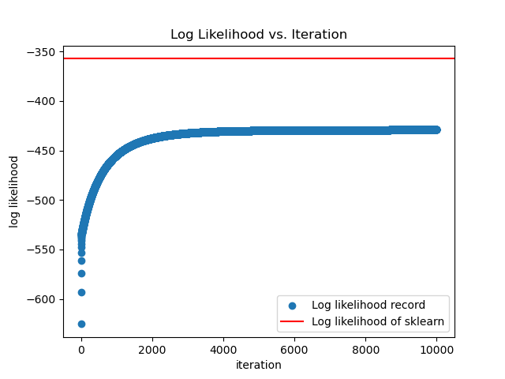
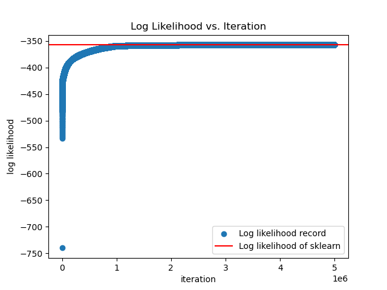

# GLM_Hackathon_Summer_2023

Data science works on GLM and scRNA-seq during summer intern 2023

---

## Contents

- [GLM\_Hackathon\_Summer\_2023](#glm_hackathon_summer_2023)
  - [Contents](#contents)
  - [Part 1: Overview](#part-1-overview)
  - [Part 2: File documentations](#part-2-file-documentations)
    - [1. Logistic regression from scratch](#1-logistic-regression-from-scratch)
      - [1.1 Variables](#11-variables)
      - [1.2 The logistic function (sigmoid function)](#12-the-logistic-function-sigmoid-function)
      - [1.3 Log likelihood](#13-log-likelihood)
      - [1.4 Gradient descent](#14-gradient-descent)
      - [1.5 Problems encountered and solutions](#15-problems-encountered-and-solutions)
    - [2. Negative binomial regression](#2-negative-binomial-regression)
    - [3. NB regression test on datasets](#3-nb-regression-test-on-datasets)
    - [4. Cell clustering and finding marker genes with scanpy](#4-cell-clustering-and-finding-marker-genes-with-scanpy)
  - [Part 3: Achievements](#part-3-achievements)
  - [Part 4: Future directions](#part-4-future-directions)

---

## Part 1: Overview

This is a repository for part of my work during the summer research internship 2023, supervised by Prof. Huang Yuanhua.

During the first one month and a half, I learned [fundamental data science skills][1] and read some materials on machine learning[^1][^2]. I have built a logistic regression model from scratch by implementing gradient descent, and a negative binomial regression model which fits the parameters $\beta$ and dispersion factor $\phi$ by using the [optimize function by statsmodels][2].

Additionally, I used my models to analyze some public datasets and got decent results, which are introduced in detail in [Part 2: File documentations](#part-2-file-documentations).

Meanwhile, I learned the basic procedures of scRNA-seq analysis and got familiar with some important tools such as docker and [scanpy][3]. As a small project, I used scanpy to cluster and find marker genes to annotate a public dataset and compared with the author's results, which aligned relatively well.


[1]: https://github.com/StatBiomed/GLM-hackathon

[2]: https://docs.scipy.org/doc/scipy/reference/generated/scipy.optimize.minimize.html

[3]: https://scanpy-tutorials.readthedocs.io/en/latest/#

[^1]: [**_Probabilistic Machine Learning: An Introduction_** by *Kevin P Murphy*](https://probml.github.io/pml-book/book1.html)

[^2]: [**_An Introduction to Statistical Learning_**](https://www.statlearning.com)

---

## Part 2: File documentations


### 1. Logistic regression from scratch

In this part, I implemented logistic regression from scratch by coding the log likelihood function and the gradient descent. This model is compared with [the logistic regression model in sci-kit learn](https://scikit-learn.org/stable/modules/generated/sklearn.linear_model.LogisticRegression.html).

#### 1.1 Variables
   
   **features:** 
   ```math
   \boldsymbol{x} = 
   \begin{bmatrix}
   x_1\\
   x_2\\
   \vdots\\
   x_n 
   \end{bmatrix}
   ```
   where $x_i = \left(x_{i1}, x_{i2}, ..., x_{ip}\right)$ is *p* dimensional

   **parameters:**
   ```math
    \boldsymbol{\beta} = \begin{bmatrix}
    \beta_1\\
    \beta_2\\
    \vdots\\
    \beta_n
    \end{bmatrix}
   ```

   **observed variables:**
   ```math
   \boldsymbol{y} = \begin{bmatrix}
    y_1\\
    y_2\\
    \vdots\\
    y_n
    \end{bmatrix}
   ```
   
   
   **linear predictor:**
   ```math
   \eta = \boldsymbol{\beta^Tx} = \beta_1x_1 + \beta_2x_2 + ... + \beta_px_p
   ```

#### 1.2 The logistic function (sigmoid function)

The linear predictor $\eta$ has a range of $\left[-\infty, +\infty\right]$. However, we hope that the model can predict the **probability** of $y = 1$. And probabilities have a range of $[0, 1]$. Therefore, a function is used to convert $\boldsymbol{\beta^Tx} \in \left[-\infty, +\infty\right]$ to $P \in \left[0, 1\right]$:

   $$\sigma\left(z\right) = \frac{1}{1 + \exp\left(-z\right)}$$

The probability therefore is:

  $$P(y = 1 | \beta, x) = \sigma\left(\boldsymbol{\beta^Tx}\right)$$

  The decision boundary is

  ```math
  \hat{y} = \left\{
    \begin{aligned}
    1, \quad if \ P\left(y = 1 | \boldsymbol{\beta}, x\right) \geq 0.5 \\
    0, \quad if \ P\left(y = 1 | \boldsymbol{\beta}, x\right) < 0.5
    \end{aligned}
  \right.
  ```

  As $\sigma(0) = 0.5$, this is equivalent to 

  ```math
  \hat{y} = \left\{
    \begin{aligned}
    1, \quad if \ \boldsymbol{\beta^Tx} \geq 0 \\
    0, \quad if \ \boldsymbol{\beta^Tx} < 0
    \end{aligned}
  \right.
  ```

  Additionally, the derivative of $\sigma(z)$ is 

  $$\sigma^\prime(z) = \sigma(z) \cdot (1 - \sigma(z)) $$

  As we will see in the next section, $\sigma(z)$ will be used in the log likelihood function. To derive the gradient of the log likelihood, which will be used in gradient descent, $\sigma^\prime(z)$ is needed.

  This is how the sigmoid function is implemented in Python:
  ```python
  def sigmoid(z):
      s = 1 / (1 + np.exp(-z))
      return s
  ```

#### 1.3 Log likelihood

The log likelihood is a measure of how good a model is, or how probable a model is to predict the observed data[^3]. It is a function of parameters $\beta$, thus we can determine the optimized $\beta$ by finding the maximum of the log likelihood.

**The likelihood function:**
```math
\begin{split}
L(\boldsymbol{\beta}) & = \prod_{i=1}^{N} Ber(y_i | \mu_i = \sigma(\boldsymbol{\beta^Tx_i}))\\
& = \prod_{i=1}^{N} P(y_i = 1 | \boldsymbol{\beta}, x_i)^{y_i}
(1 - P(y_i = 1 | \boldsymbol{\beta}, x_i))^{y_i}
\end{split}
```

**Log likelihood:**
 ```math
LL(\boldsymbol{\beta}) = \sum_{i=1}^{N} [ y_i \log(\mu_i) + (1 - y_i) \log(1 - \mu_i)]
 ```

**Negative log likelihood, scaled by dataset size N:**
```math
NLL(\boldsymbol{\beta}) = - \frac{1}{N} \sum_{i=1}^{N} [ y_i \log(\mu_i) + (1 - y_i) \log(1 - \mu_i)]
```
which can be minimized to find $\beta$.

My implementation for log likelihood:
```python
def LL(model, parameters):
    y_pred = sigmoid(np.dot(model.X, parameters)) # mu
    log_l = model.Y * np.log(y_pred) + (1 - model.Y) * np.log(1 - y_pred)
    return np.sum(log_l)
```
to make the LL comparable with the sci-kit learn model, the direct $LL(\boldsymbol{\beta})$ is used instead of $NLL(\boldsymbol{\beta})$.

[^3]: ["Maximum likelihood estimation", Wikipedia](https://en.wikipedia.org/wiki/Maximum_likelihood_estimation)

#### 1.4 Gradient descent

Unfortunately, unlike linear regression, the $LL(\boldsymbol{\beta})$ of logistic regression has no analytical solution (or to be more specific, $LL^\prime(\boldsymbol{\beta}) = 0$ has no analytical solution). Thus, we use a numerical way to approximate its maximum.

As its name suggests, gradient descent simply means descending along the gradient. This is like going down a hill, by taking each step, you are a little bit closer to the bottom of the valley.

Firstly, we need to have the gradient of $LL(\boldsymbol{\beta})$.

```math
\begin{split}
LL^\prime(\boldsymbol{\beta}) 
& = (\sum_{i=1}^{N} [ y_i \log(\mu_i) + (1 - y_i) \log(1 - \mu_i)])^\prime \\
& = \sum_{i=1}^{N} [y_i\frac{\sigma(\beta^Tx_i)(1 - \sigma(\beta^Tx_i))}{\sigma(\beta^Tx_i)}x_i + (1 - y_i)\frac{-\sigma(\beta^Tx_i)(1 - \sigma(\beta^Tx_i))}{1 - \sigma(\beta^Tx_i)}x_i] \\
& = \sum_{i=1}^{N} x_i(y_i - \sigma(\beta^Tx_i)) \\
& = \sum_{i=1}^{N} x_i(y_i - \hat{y})
\end{split}
```

This is done simply by applying the chain rule to take the derivative of $LL(\boldsymbol{\beta}$).

Assume we start at $\boldsymbol{\beta_t}$, to get to $\boldsymbol{\beta_{t+1}}$, 
```math
\boldsymbol{\beta_{t+1}} = \boldsymbol{\beta_t} + \eta_t LL^\prime(\boldsymbol{\beta_t}) 
```
where $\eta_t$ is the **learning rate** or step size.

We can use a `for` loop to iterate this step. Each iteration brings $\boldsymbol{\beta}$ closer to the optimum.

Here's the Python implementation:
```python
def gradient_descent(model, n_iter, learning_rate):
    parameters = np.array(model.params)
    LL_record = np.ones(n_iter)
    for i in range(n_iter):
        Y_pred = sigmoid(np.dot(model.X, parameters))
        gradient = np.dot(model.X.T, (model.Y - Y_pred))
        parameters += learning_rate * gradient
        LL_record[i] = LL(model, parameters)
    return parameters, LL_record
```

An array `LL_record` is used to store the function value of $LL(\boldsymbol{\beta}$) after each iteration, which is useful for adjusting the parameters `n_iter` and `learning_rate`. As we will see in next section, this can be troublesome sometimes.

#### 1.5 Problems encountered and solutions

Having implemented the model, I tried to test it on a datdset. The first time I ran my model, I compared it with the model in sci-kit learn. The results were distressing.



The log likelihood of my model **seemed** to have converged, but it was signifiantly different from the $LL$ of the sci-kit learn model.

I checked my $LL$ function and the `gradient_descent` function, but nothing was found. What else can be wrong?

Well, as it turned out, the `n_iter` and `learning_rate` can be wrong. Prof. Huang solved this problem by increasing `n_iter` to 5,000,000.




### 2. Negative binomial regression

### 3. NB regression test on datasets

### 4. Cell clustering and finding marker genes with scanpy
---


## Part 3: Achievements

---

## Part 4: Future directions